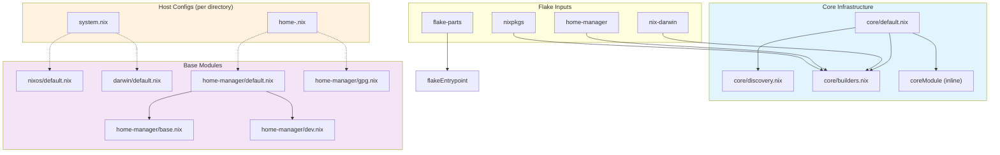
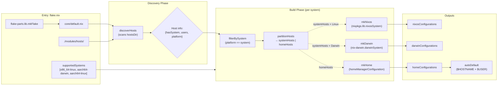
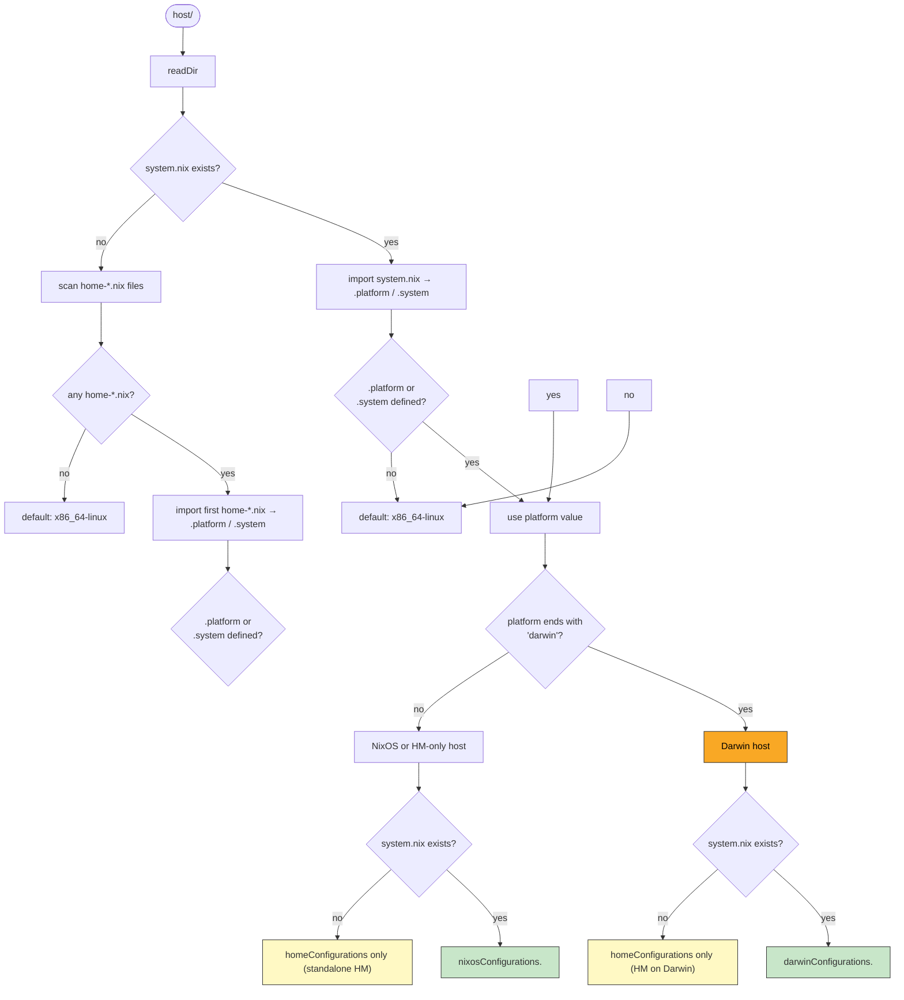
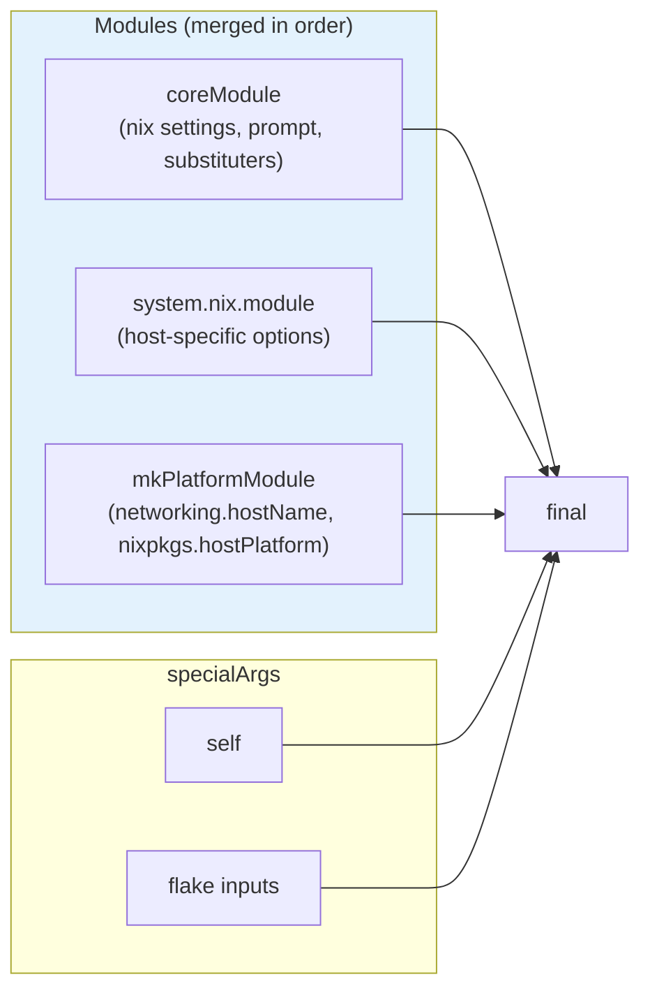
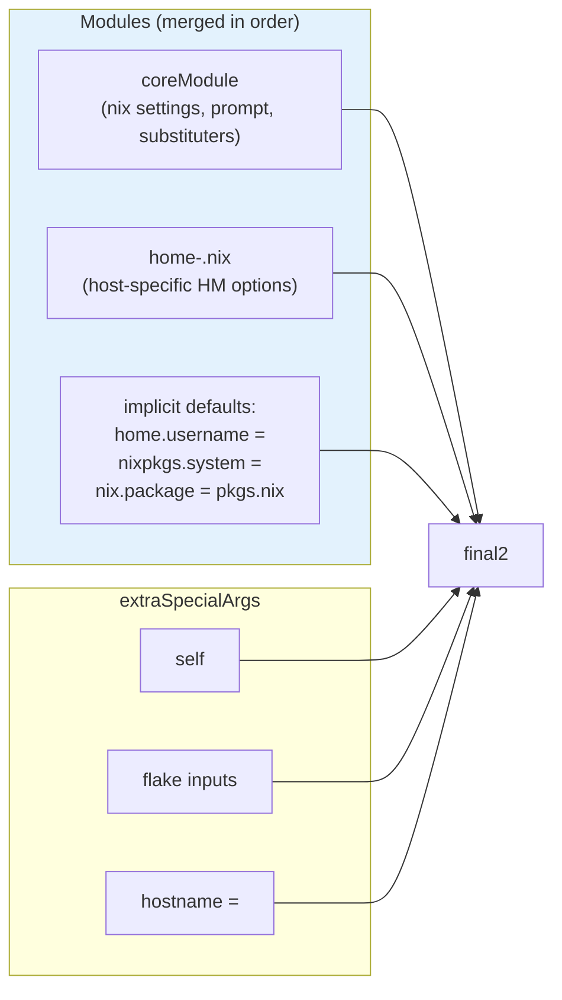

# DESIGN — Architecture & Dependencies

## Module Dependency Graph

Static import relationships between all module files.



## Build Pipeline

Runtime evaluation flow from flake entry point to final configurations.



## Host Type Resolution

How a host directory is classified into NixOS, Darwin, or Home Manager–only.



## Configuration Composition

How modules are merged for each configuration type.

### NixOS Host



### Darwin Host

Same as NixOS, plus:

- `inputs.home-manager.darwinModules.home-manager` inserted after system module
- All other modules identical

### Home Manager Config (`<user>@<host>`)



## Data Flow Summary

```mermaid
graph LR
    subgraph Static ["Static (builtins.readDir)"]
        hosts["modules/hosts/ directory tree"]
    end

    subgraph Eval ["Evaluation time"]
        disc["discoverHosts\n→ {<host>: {hasSystem, users, platform}}"]
        part["partition by system →\n{systemHosts, homeHosts}"]
        build["buildAllConfigs\n→ {nixos, darwin, home}"]
    end

    subgraph Runtime ["Runtime (env vars)"]
        env["$HOSTNAME", "$USER"]
        auto["autoDefault\n→ homeConfigurations.default"]
    end

    hosts --> disc
    disc --> part
    part --> build
    env --> auto
```

## Key Design Decisions

| Decision                                                   | Rationale                                                                                                                         |
| ---------------------------------------------------------- | --------------------------------------------------------------------------------------------------------------------------------- |
| `platform` preferred over `system` in discovery            | Avoids collision with NixOS `system.*` options; falls back to `system` attr for backwards compat                                  |
| Lazy `module` function in `system.nix`                     | Defers `pkgs` evaluation until the builder phase, giving access to the correct system's packages                                  |
| Platform detection cascades: system > first home > default | A host without `system.nix` can still declare its platform via any `home-*.nix`, keeping standalone HM hosts flexible             |
| `autoDefault` uses env vars at export time                 | Enables `home-manager switch --flake .` without specifying a config key, but only when the current user/host matches a known pair |
| Home Manager built for all hosts (even system hosts)       | Allows per-user configs alongside full system management; Darwin always includes home-manager module                              |
