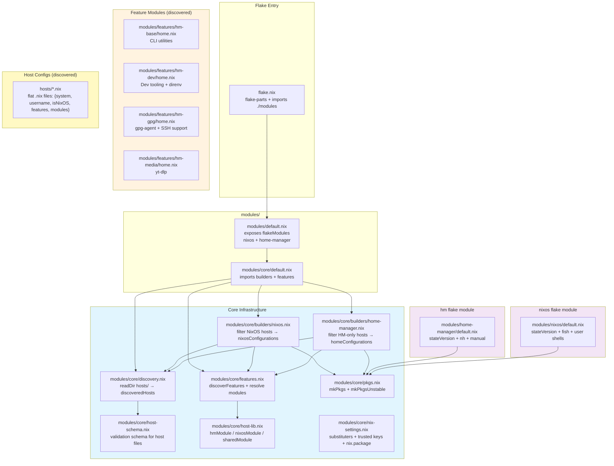
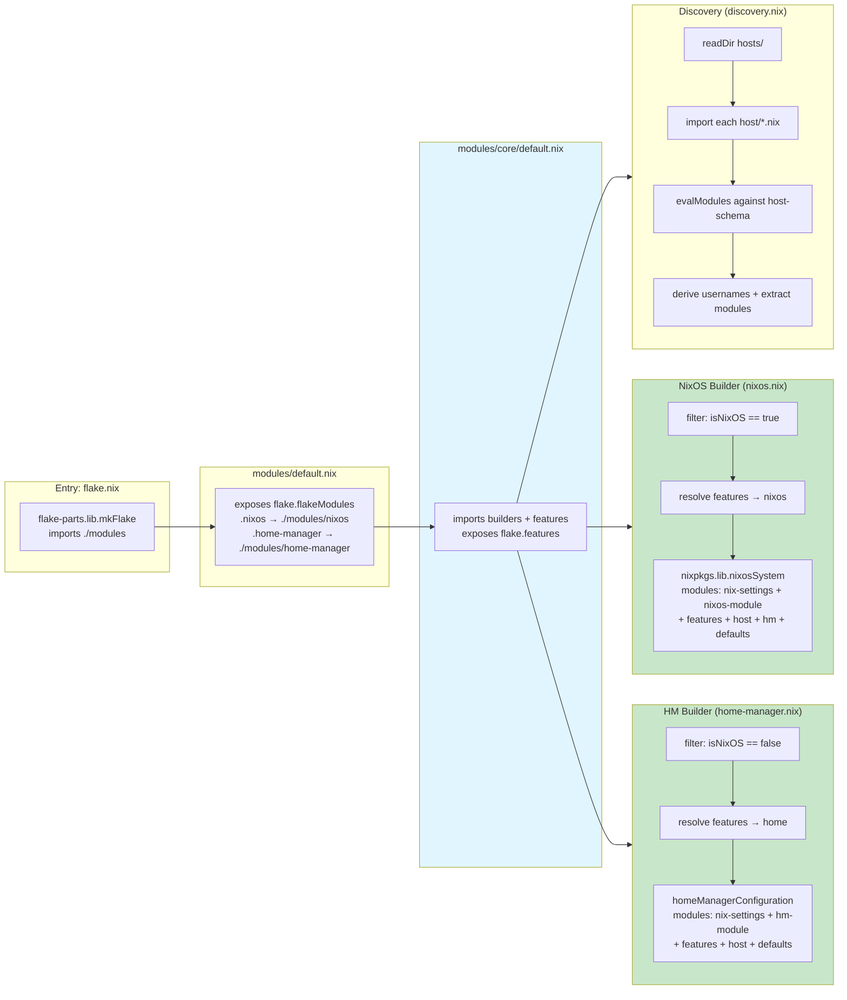
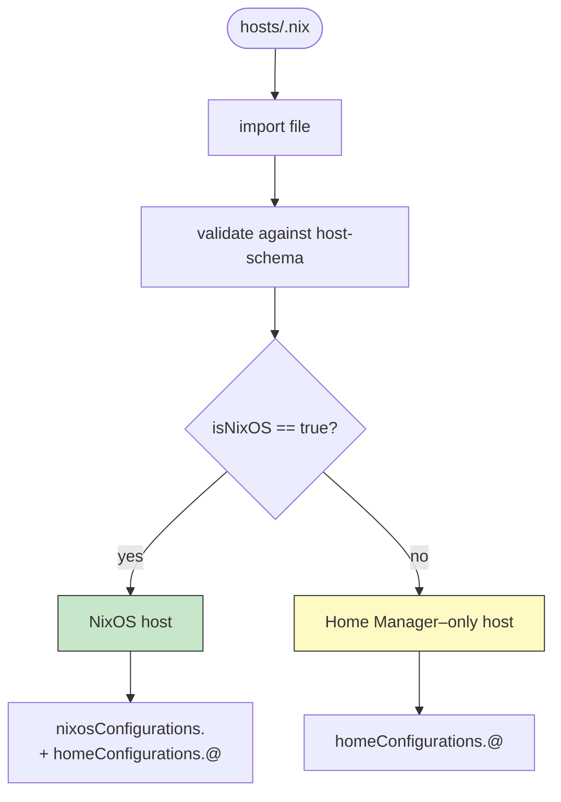
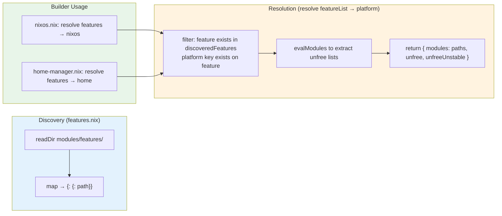
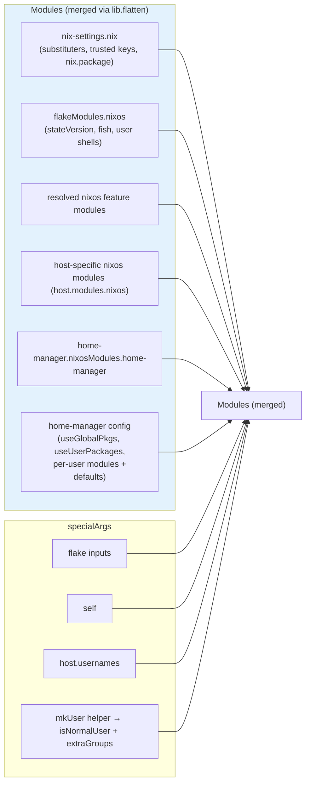
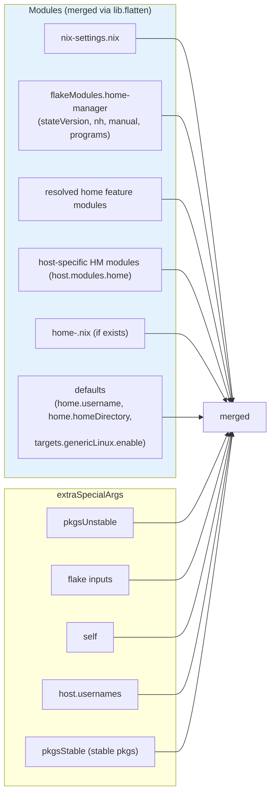
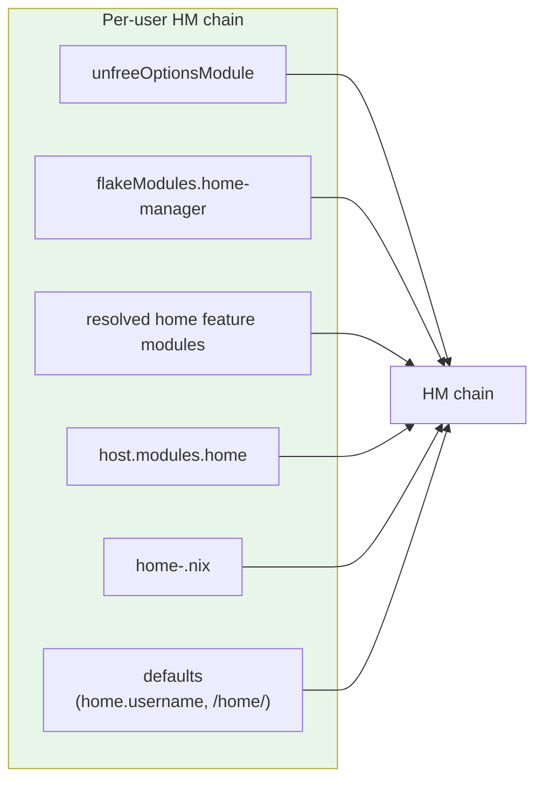

# DESIGN — Architecture & Dependencies

## Module Dependency Graph

Static import relationships between all module files.

## Build Pipeline

Runtime evaluation flow from flake entry point to final configurations.

## Host Type Resolution

A host file is classified by its `isNixOS` field.

## Feature System

Features are auto-discovered from `modules/features/<name>/` directories. Each feature directory contains platform-tagged `.nix` files (e.g., `home.nix`, `nixos.nix`).

## Configuration Composition

### NixOS Host

### Home Manager–Only Host

### NixOS Host Home Manager Integration

When `isNixOS = true`, home-manager is configured **inside** the NixOS system via `home-manager.users` with per-user module chains:

## Data Flow Summary

```mermaid
graph LR
    subgraph Static ["Static (builtins.readDir)"]
        hosts["hosts/ directory"]
        features["modules/features/ directory"]
    end

    subgraph Eval ["Evaluation time"]
        disc["discoverHosts\n→ &#123;<host>: &#123;system, isNixOS, usernames,\n features, modules&#125;&#125;"]
        buildN["nixos.nix: filter + resolve + nixosSystem"]
        buildH["home-manager.nix: filter + resolve + homeManagerConfiguration"]
    end

    hosts --> disc
    features --> disc

    disc --> buildN
    disc --> buildH

    buildN --> nixosOut["nixosConfigurations"]
    buildH --> hmOut["homeConfigurations"]

    style Static fill:#f5f5f5
    style Eval fill:#e3f2fd
```

## Key Design Decisions

| Decision                                     | Rationale                                                                                                                                                    |
| -------------------------------------------- | ------------------------------------------------------------------------------------------------------------------------------------------------------------ |
| `isNixOS` boolean in host schema             | Simple, explicit classification — `true` → NixOS host, `false` → HM-only                                                                                     |
| `system` read from host file                 | `discovery.nix` validates `system` via host-schema; used for `pkgs` resolution                                                                               |
| Flat host files (not directories)            | Single `hosts/<name>.nix` file per host; no need for `default.nix` in each host                                                                              |
| Feature modules auto-discovered              | `features.nix` scans `modules/features/` at evaluation time — no manual registration needed                                                                  |
| Unfree extraction via dry eval               | Features and user modules are evaluated in isolation to extract `unfree`/`unfreeUnstable` lists before `pkgs` is available, preventing circular dependencies |
| `flakeModules` for reusable modules          | `modules/nixos/` and `modules/home-manager/` are exposed as flake modules, usable by other flakes or imported directly                                       |
| `host-lib.nix` module taggers                | `nixosModule()`, `hmModule()`, `sharedModule()` wrap file paths with platform tags for clean host-file syntax                                                |
| `nix-settings.nix` shared across all configs | Injected into every NixOS and Home Manager configuration to ensure consistent nix settings and cachix substituters                                           |
| Separate `pkgsStable` / `pkgsUnstable`       | `pkgsLib.mkPkgs` uses `nixpkgs` input; `pkgsLib.mkPkgsUnstable` uses `nixpkgs-unstable`; each with its own unfree predicate                                  |
| `home-manager` inside NixOS vs standalone    | NixOS hosts embed home-manager via `home-manager.users`; HM-only hosts get standalone `homeManagerConfiguration`                                             |
