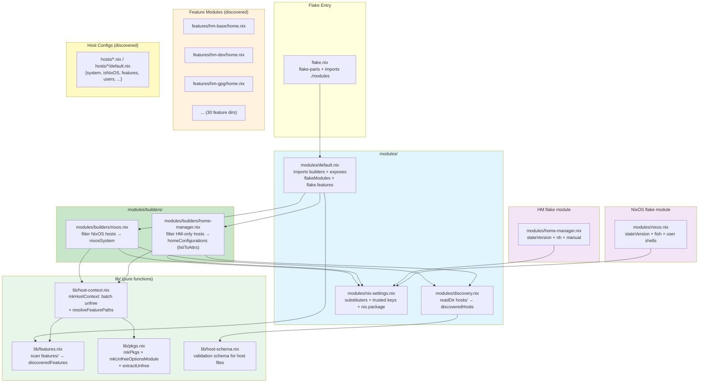
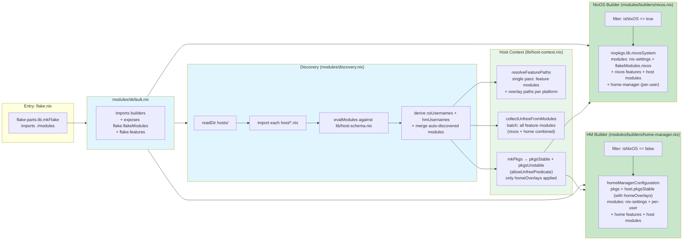
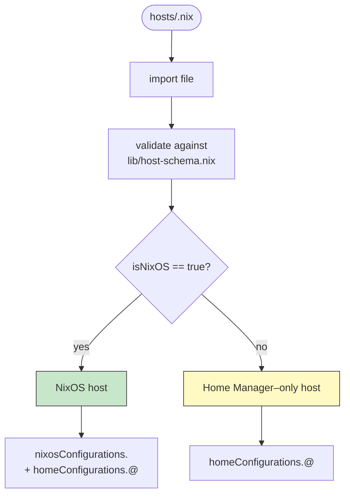
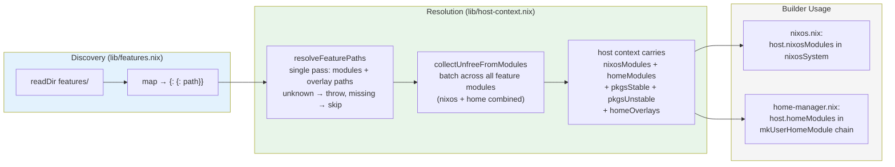
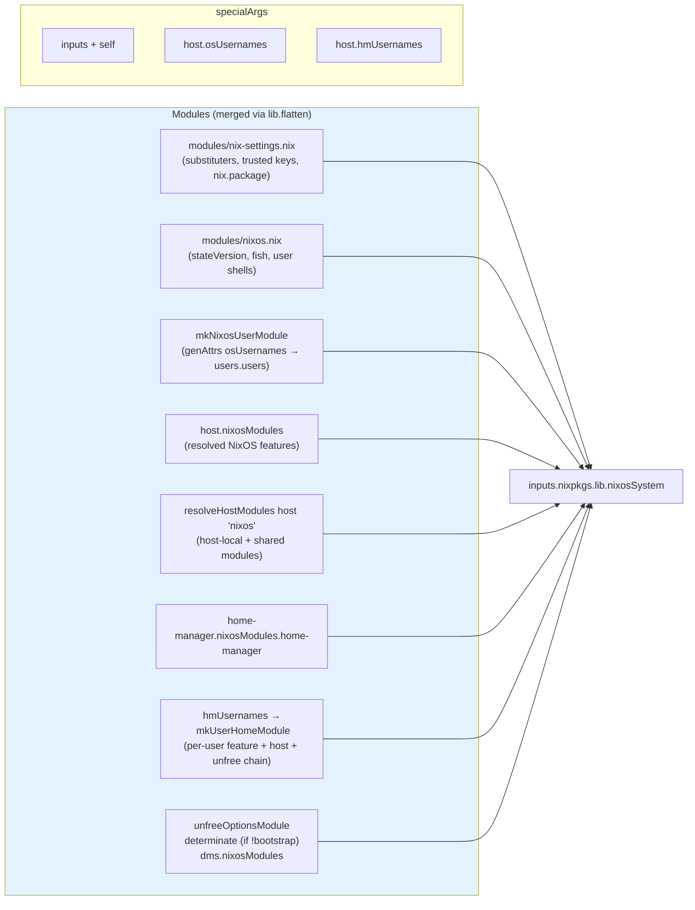
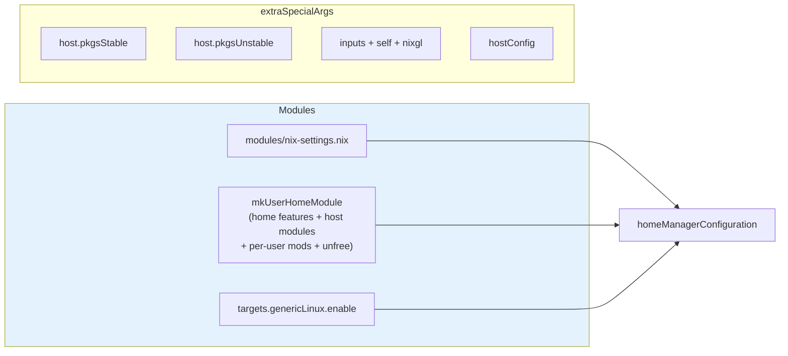
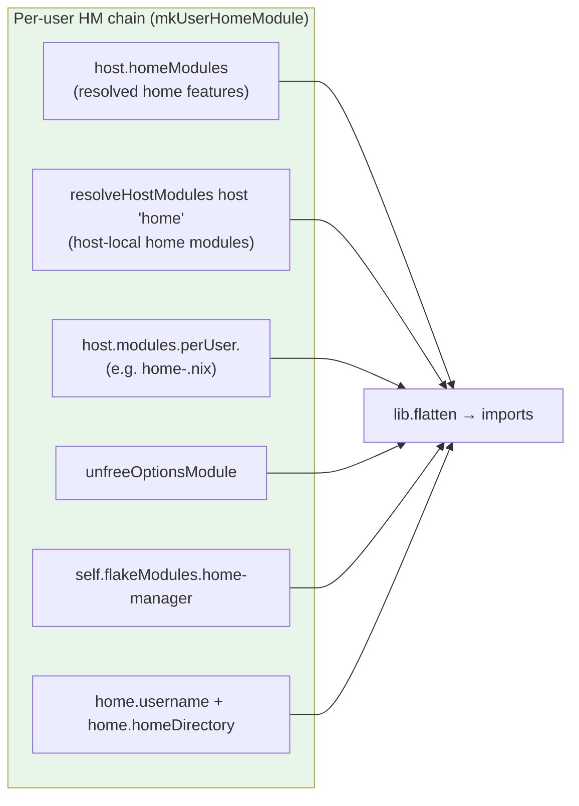
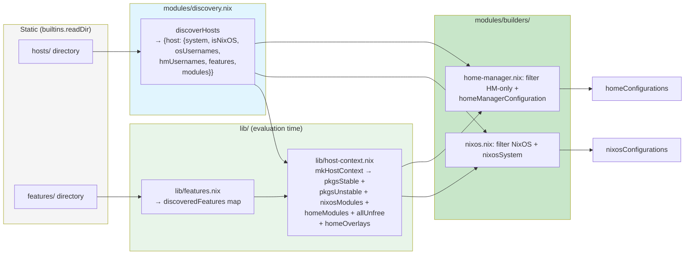

# DESIGN — Architecture & Dependencies

## File Layout

```
flakeroot/
├── flake.nix                        # flake-parts entry, imports ./modules
├── hosts/                           # per-host declarations
│   ├── methyl-bazzite.nix           # HM-only host
│   └── methyl-nixos/                # NixOS host (dir = auto-discovered modules)
│       ├── default.nix              #   schema: system, features, users
│       ├── nixos.nix                #   host-local NixOS module
│       ├── home-josh.nix            #   per-user Home Manager module
│       └── hardware-configuration.nix
├── features/                        # composable config units (30 dirs)
│   ├── hm-base/
│   ├── hm-dev/
│   ├── nixos-base/
│   └── ...
├── lib/                             # pure Nix library (no options/config)
│   ├── pkgs.nix                     # mkPkgs, mkUnfreeOptionsModule, extractUnfree
│   ├── features.nix                 # discoveredFeatures: scan features/ → map
│   ├── host-context.nix             # central seam: unfree + pkgs + features
│   ├── host-schema.nix              # host declaration validation schema
└── modules/                         # flake-parts + NixOS/HM modules
    ├── default.nix                  # flake-parts: imports builders, exposes flakeModules + flake.features
    ├── discovery.nix                # discoveredHosts option: readDir hosts/
    ├── nix-settings.nix             # nix daemon config (substituters, keys)
    ├── nixos.nix                    # NixOS flake module (stateVersion, fish, user shells)
    ├── home-manager.nix             # HM flake module (stateVersion, manual, nh)
    └── builders/
        ├── nixos.nix                # flake-parts module → nixosConfigurations
        └── home-manager.nix         # flake-parts module → homeConfigurations
```

---

## Module Dependency Graph

Static import relationships between all module files.



---

## Build Pipeline

Runtime evaluation flow from flake entry to final configurations.



---

## Host Type Resolution

A host file is classified by its `isNixOS` field in the schema.



---

## Feature System

Features are auto-discovered from `features/<name>/` directories. Each directory contains platform-tagged `.nix` files (e.g., `home.nix`, `nixos.nix`). Resolution is handled by `lib/host-context.nix`, which silently skips features without a module for the requested platform and throws on unknown feature names.



---

## Configuration Composition

### NixOS Host



### Home Manager–Only Host



### NixOS Host — Home Manager Integration

When `isNixOS = true`, home-manager runs inside NixOS via `home-manager.users`. Each user gets a module chain built by `mkUserHomeModule`:



---

## Data Flow Summary



---

## Key Design Decisions

| Decision                                     | Rationale                                                                                                                                                                                                                                                                                     |
| -------------------------------------------- | --------------------------------------------------------------------------------------------------------------------------------------------------------------------------------------------------------------------------------------------------------------------------------------------- |
| `isNixOS` boolean in host schema             | Simple, explicit classification — `true` → NixOS host, `false` → HM-only                                                                                                                                                                                                                      |
| `system` read from host file                 | `discovery.nix` validates `system` via host-schema; used for `pkgs` resolution                                                                                                                                                                                                                |
| Flat host files + directory hosts            | Single `hosts/<name>.nix` for simple hosts; directory hosts auto-discover `nixos.nix`, `shared.nix`, `home-<user>.nix` from the directory                                                                                                                                                     |
| Feature modules auto-discovered              | `lib/features.nix` scans `features/` at evaluation time — no manual registration needed                                                                                                                                                                                                       |
| Host context (batched unfree, home-only overlays) | `lib/host-context.nix` extracts unfree in two passes: one batch across all feature modules (nixos + home combined), and one for per-user modules. Overlays are only extracted for home-manager (`homeOverlays`); nixos overlays were unused dead code. `resolveFeaturePaths` combines module + overlay path resolution into a single iteration. |
| `lib/` is pure functions                     | Nothing in `lib/` has `options`, `config`, or `imports` at the top level. Everything is importable without side effects                                                                                                                                                                       |
| `modules/` wires the system                  | Flake-parts modules, NixOS/HM modules, and discovery logic live here — they contribute to the module system                                                                                                                                                                                   |
| Two builders, not one                        | `nixos.nix` and `home-manager.nix` have different output targets (`nixosConfigurations` vs `homeConfigurations`), different pkgs wiring (`useGlobalPkgs` vs explicit `pkgs` arg), and different module frameworks — keeping them separate is clearer than a unified builder with conditionals |
| `flakeModules` for reusable modules          | `modules/nixos.nix` and `modules/home-manager.nix` are exposed as flake modules, usable by other flakes or imported directly                                                                                                                                                                  |
| `nix-settings.nix` shared across all configs | Injected into every NixOS and Home Manager configuration to ensure consistent nix settings and cachix substituters                                                                                                                                                                            |
| Separate `pkgs` / `pkgsUnstable`             | `mkPkgs` called with `nixpkgs` for stable, `nixpkgs-unstable` for unstable; each with its own `allowUnfreePredicate`                                                                                                                                                                          |
| `hmEnabled` per-user toggle                  | `users.<name>.hmEnabled = false` creates the NixOS system user but skips loading their home-manager module                                                                                                                                                                                    |
| `home-manager` inside NixOS vs standalone    | NixOS hosts embed home-manager via `home-manager.users`; HM-only hosts get standalone `homeManagerConfiguration`                                                                                                                                                                              |
