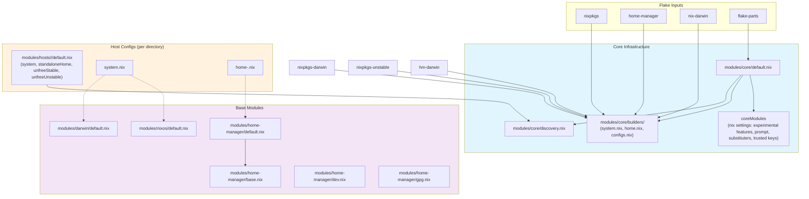
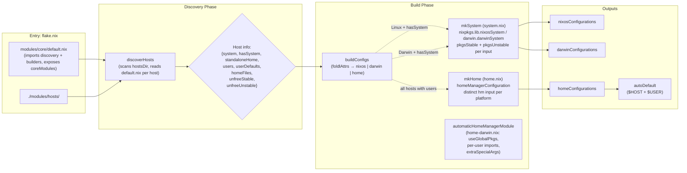
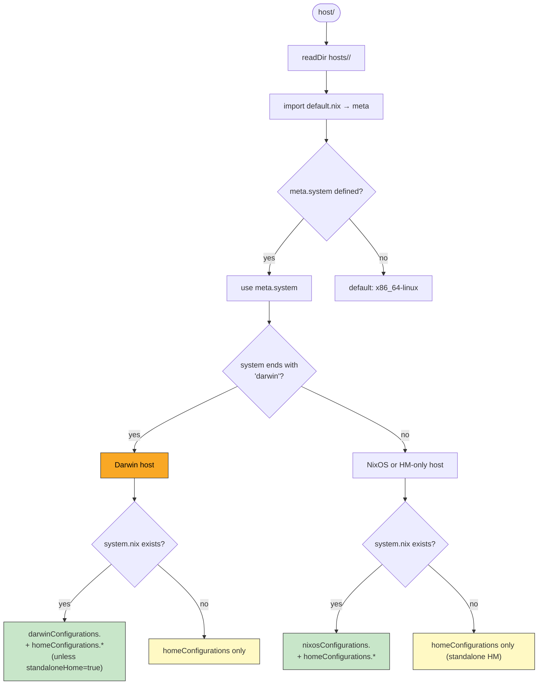
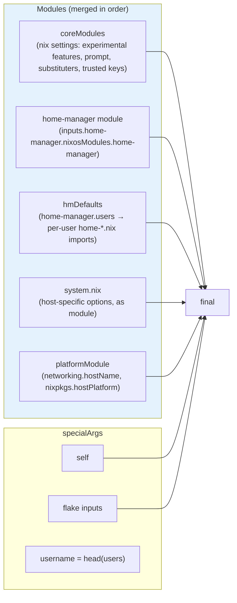
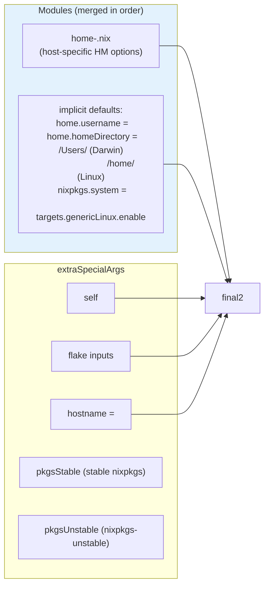
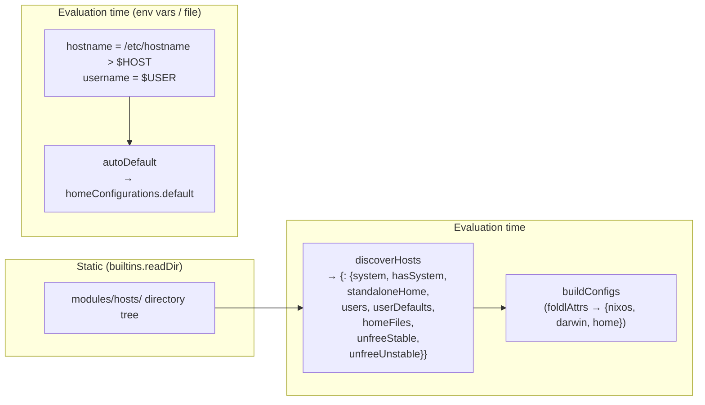

# DESIGN — Architecture & Dependencies

## Module Dependency Graph

Static import relationships between all module files.

## Build Pipeline

Runtime evaluation flow from flake entry point to final configurations.

## Host Type Resolution

How a host directory is classified into NixOS, Darwin, or Home Manager–only.

## Configuration Composition

How modules are merged for each configuration type.

### NixOS Host

### Darwin Host

Same as NixOS, plus:

- Uses `inputs.home-manager-darwin.darwinModules.home-manager` (vs `nixosModules` on Linux)
- Uses `inputs.nixpkgs-darwin` for stable packages (`pkgsStable`) and `inputs.nixpkgs-unstable` for unstable (`pkgsUnstable`)
- `automaticHomeManagerModule` from `home-darwin.nix`: sets `useGlobalPkgs = true`, `useUserPackages = true`, per-user imports, and `extraSpecialArgs`
- `nixpkgs.pkgs = pkgs` override in darwin module list
- All other modules identical

### Home Manager Config (`<user>@<host>`)

## Data Flow Summary

## Deployment with nh (nhctl)

This flake is designed to work seamlessly with [nh (nhctl)](https://github.com/nhdb/nh). The `nh` client provides the following subcommands for interacting with this flake:

| Subcommand         | Purpose                                                                |
| ------------------ | ---------------------------------------------------------------------- |
| `nh os switch`     | Build and activate NixOS system configuration                          |
| `nh darwin switch` | Build and activate Darwin system configuration                         |
| `nh home switch`   | Build and activate Home Manager configuration (auto-detects user@host) |

`nh` handles evaluation, building, and activation in a single command, and automatically discovers the appropriate configuration based on the current host and user. It is the preferred way to interact with this flake.

## Key Design Decisions

| Decision                                                                    | Rationale                                                                                                                                                                        |
| --------------------------------------------------------------------------- | -------------------------------------------------------------------------------------------------------------------------------------------------------------------------------- |
| `system` read from `default.nix` in discovery                               | `discoverHosts` reads `meta.system` directly from each host's `default.nix`, falling back to `x86_64-linux` if undefined                                                         |
| `system.nix` imported as a module (not `{ system, module }`)                | `mkSystem` imports `system.nix` directly as a NixOS/Darwin module; `system` is inherited from `default.nix` via `inherit system`                                                 |
| `autoDefault` uses env vars at evaluation time                              | Enables `home-manager switch --flake .` without specifying a config key, but only when the current user/host matches a known pair                                                |
| Home Manager built for all hosts with users                                 | `mkHome` runs for every user in every host; both NixOS and Darwin system configs include the home-manager module with per-user configs merged via `hmCommon.users`               |
| Per-pkgs-input unfree predicate (`mkAllowUnfree`)                           | Each pkgs input (stable/unstable) has its own allowUnfreePredicate, so unfree packages are whitelisted per-input. Build fails if an unfree package is used without being listed. |
| Separate `nixpkgs-darwin` and `home-manager-darwin` inputs for Darwin hosts | Darwin builds use platform-specific nixpkgs and home-manager branches to avoid cross-platform incompatibilities                                                                  |
| `standaloneHome` metadata field                                             | When `true`, a Darwin host skips `darwinConfigurations` entirely, producing only `homeConfigurations` — useful for HM-only setups on macOS                                       |
| Stable vs unstable package sets (`pkgsStable` / `pkgsUnstable`)             | Hosts declare `unfreeStable` and `unfreeUnstable` separately; stable uses `nixpkgs-darwin`/`nixpkgs`, unstable always uses `nixpkgs-unstable`                                    |
| `home-darwin.nix` automatic module for Darwin                               | On Darwin, an implicit home-manager module is injected with `useGlobalPkgs = true`, per-user imports, and shared specialArgs — avoiding duplication in system.nix                |
