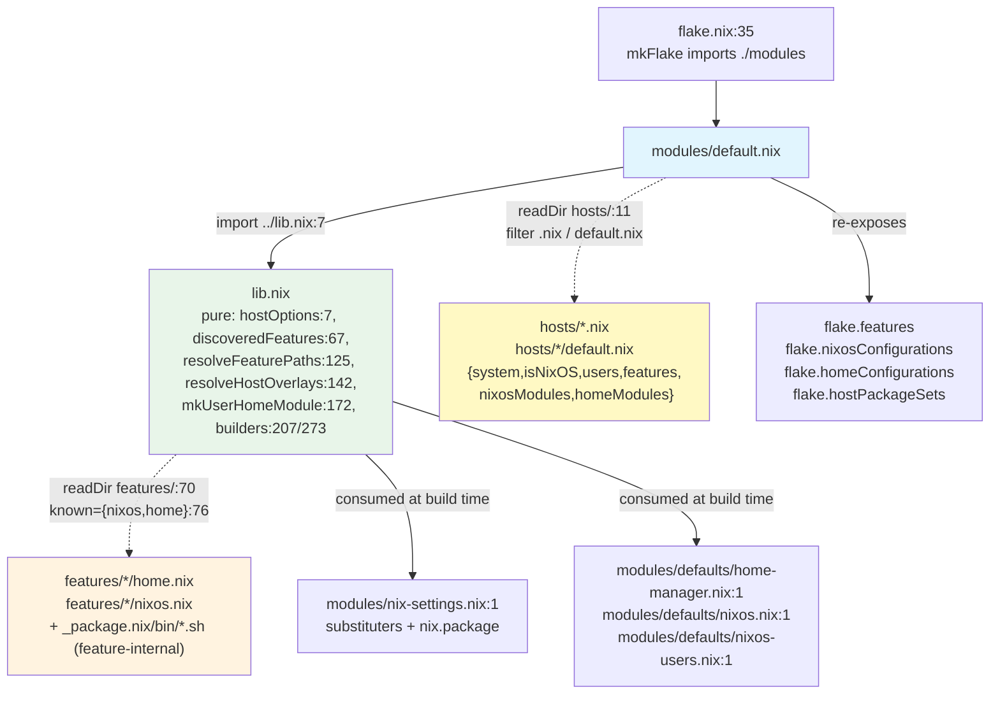
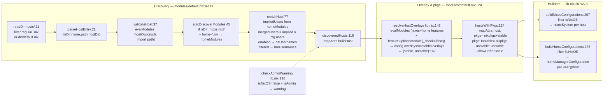
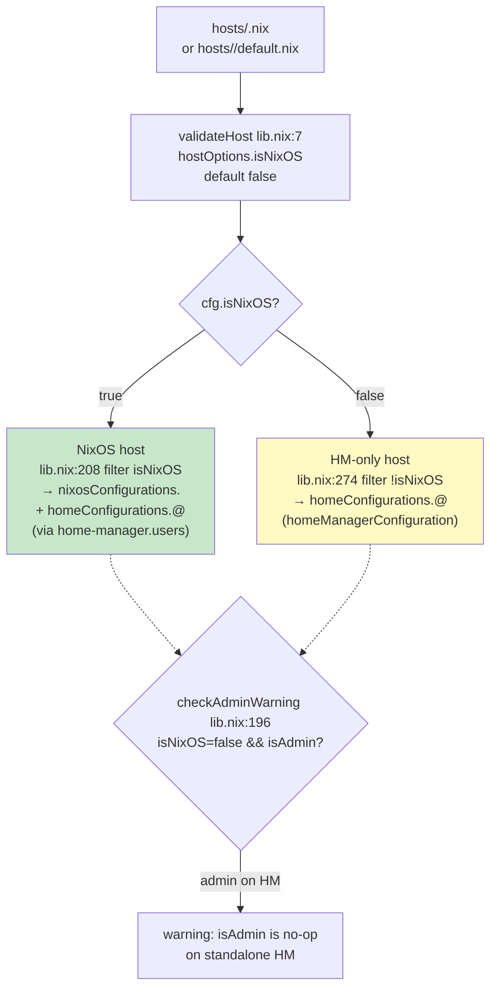
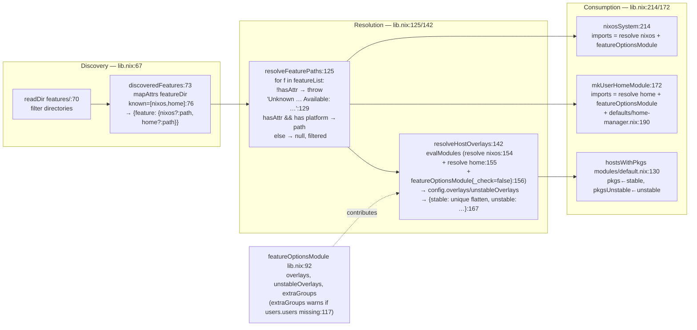
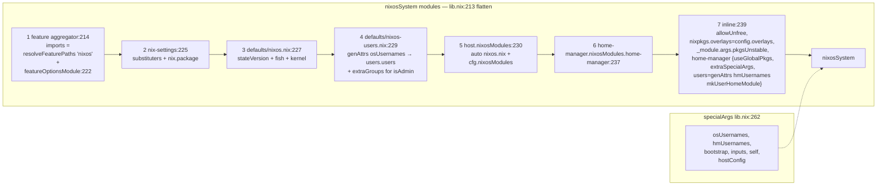
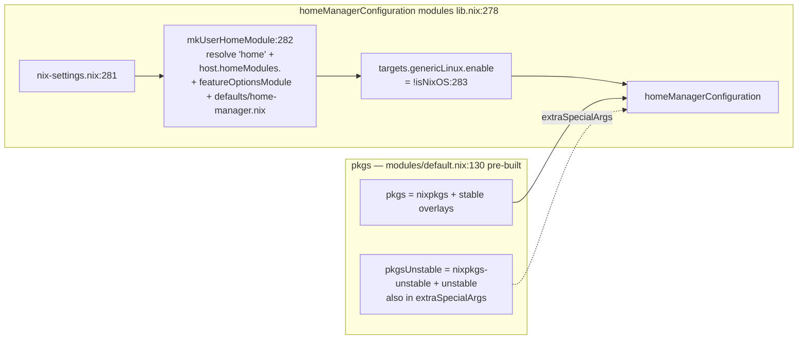
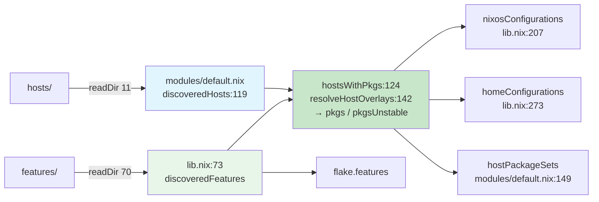

# DESIGN — Architecture & Dependencies

## File Layout

```
flakeroot/
├── flake.nix                       # flake-parts entry, imports ./modules
├── lib.nix                         # pure lib: hostOptions, feature discovery, overlays, builders
├── hosts/                          # per-host declarations (auto-discovered)
│   ├── methyl-bazzite.nix          # HM-only flat host
│   ├── methyl/                     # NixOS host (bare metal)
│   │   ├── default.nix             #   {system,isNixOS,users,features}
│   │   ├── base.nix                #   shared NixOS config (no hw import)
│   │   ├── nixos.nix               #   host wrapper: hw-config + base
│   │   ├── home-josh.nix           #   per-user HM module
│   │   └── hardware-configuration.nix
│   └── methyl-nixos/               # NixOS host (QEMU VM — reuses methyl/)
│       ├── default.nix
│       ├── nixos.nix
│       ├── home-josh.nix           #   re-imports ../methyl/home-josh.nix
│       └── hardware-configuration.nix
├── features/                       # 36 composable units, auto-discovered
│   ├── hm-only    (11)             #   home.nix only
│   ├── nixos-only (17)             #   nixos.nix only
│   ├── hybrid      (8)             #   home.nix + nixos.nix: hm-syncthing, nixos-dmemcg, nixos-dms, nixos-flatpak, nixos-kde, nixos-lsfg, nixos-niri, nixos-oom
│   └── extras                      #   _package.nix / _*.nix / bin/ / *.sh imported by the feature itself
├── modules/
│   ├── default.nix                 # host discovery + pkgs wiring → nixosConfigurations/homeConfigurations
│   ├── bootstrap.nix               # swapfile+zswap for /etc/nixos/swap-prepare.nix (bootstrap.sh)
│   ├── nix-settings.nix            # substituters, trusted keys, nix.package
│   ├── defaults/
│   │   ├── home-manager.nix        # stateVersion, manual off, username/homeDirectory
│   │   ├── nixos.nix               # stateVersion, fish, kernel
│   │   └── nixos-users.nix         # genAttrs osUsernames → users.users (+ extraGroups)
│   └── packages/
│       └── pyz-wrapper.nix         # generic .pyz fetcher (gamemode, etc.)
├── bootstrap.sh
├── flake.nix / flake.lock
├── lib.nix
└── DESIGN.md / README.md / REPORT.md / RESEARCH.md
```

Feature file convention: `home.nix` → HM platform, `nixos.nix` → NixOS platform. Extras (`_package.nix`, `_*.nix`, `bin/`, `*.sh`) are imported by the feature's own entry point, not discovered.

---

## Module Dependency Graph

Static `imports` vs. runtime `readDir`/`evalModules`.


```mermaid
graph TB
    flake["flake.nix:35\nmkFlake imports ./modules"] --> modDefault["modules/default.nix"]

    modDefault -- "import ../lib.nix:7" --> libNix["lib.nix\npure: hostOptions:7, discoveredFeatures:67,\nresolveFeaturePaths:125, resolveHostOverlays:142,\nmkUserHomeModule:172, builders:207/273"]
    modDefault -. "readDir hosts/:11\nfilter .nix / default.nix" .-> hosts["hosts/*.nix\nhosts/*/default.nix\n{system,isNixOS,users,features,\n nixosModules,homeModules}"]
    libNix -. "readDir features/:70\nknown={nixos,home}:76" .-> features["features/*/home.nix\nfeatures/*/nixos.nix\n+ _package.nix/bin/*.sh (feature-internal)"]

    libNix -- "consumed at build time" --> nixSettings["modules/nix-settings.nix:1\nsubstituters + nix.package"]
    libNix -- "consumed at build time" --> defaults["modules/defaults/home-manager.nix:1\nmodules/defaults/nixos.nix:1\nmodules/defaults/nixos-users.nix:1"]
    modDefault -- "re-exposes" --> flakeOut["flake.features\nflake.nixosConfigurations\nflake.homeConfigurations\nflake.hostPackageSets"]

    style libNix fill:#e8f5e9
    style modDefault fill:#e1f5fe
    style hosts fill:#fff9c4
    style features fill:#fff3e0
```

`lib.nix` has no `options`/`config` at top level — pure functions. `modules/default.nix` is the sole impure wiring layer (`readDir`, `import`, `evalModules`). `nix-settings.nix` and `defaults/*` are not statically imported by `modules/default.nix`; they are injected by the builders in `lib.nix:225/281`.

---

## Build Pipeline

Evaluation order in `modules/default.nix` → `lib.nix`.


```mermaid
flowchart LR
    subgraph Disc ["Discovery — modules/default.nix:9-119"]
        scan["readDir hosts/:11\nfilter regular .nix\nor dir/default.nix"] --> parse["parseHostEntry:21\n{isDir,name,path,hostDir}"]
        parse --> validate["validateHost:37\nevalModules [hostOptions:6,\n import path]"]
        validate --> auto["autoDiscoverModules:45\nif isDir: nixos.nix?\n+ home-*.nix → homeModules"]
        auto --> enrich["enrichHost:77\nimpliedUsers from homeModules\nmergedUsers = implied // cfg.users\nenabled → osUsernames\nfiltered → hmUsernames"]
        enrich --> discovered["discoveredHosts:119\nmapAttrs buildHost"]
    end
    subgraph Pkgs ["Overlay & pkgs — modules/default.nix:124"]
        overlays["resolveHostOverlays lib.nix:142\n evalModules (nixos+home features\n + featureOptionsModule{_check=false})\n → config.overlays/unstableOverlays\n → {stable, unstable}:167"]
        mkPkgs["hostsWithPkgs:124\nmapAttrs host:\n pkgs= nixpkgs+stable\n pkgsUnstable= nixpkgs-unstable+unstable\n allowUnfree=true"]
        overlays --> mkPkgs
    end
    subgraph Out ["Builders — lib.nix:207/273"]
        nixos["buildNixosConfigurations:207\nfilter isNixOS\n→ nixosSystem per host"]
        hm["buildHomeConfigurations:273\nfilter !isNixOS\n→ homeManagerConfiguration\n per user@host"]
    end
    discovered --> overlays
    mkPkgs --> nixos & hm

    checkWarn["checkAdminWarning lib.nix:196\nisNixOS=false + isAdmin → warning"] -.-> discovered
```

`hostsWithPkgs` computed once (`modules/default.nix:124`) and shared by both builders — single overlay evaluation per host.

---

## Host Type Resolution


```mermaid
flowchart TD
    f["hosts/<name>.nix\nor hosts/<name>/default.nix"] --> v["validateHost lib.nix:7\n hostOptions.isNixOS default false"]
    v --> q{"cfg.isNixOS?"}
    q -->|true| N["NixOS host\nlib.nix:208 filter isNixOS\n→ nixosConfigurations.<name>\n+ homeConfigurations.<user>@<name>\n(via home-manager.users)"]
    q -->|false| H["HM-only host\nlib.nix:274 filter !isNixOS\n→ homeConfigurations.<user>@<name>\n(homeManagerConfiguration)"]

    N -.-> warnCheck{"checkAdminWarning lib.nix:196\nisNixOS=false && isAdmin?"}
    H -.-> warnCheck
    warnCheck -->|admin on HM| warn["warning: isAdmin is no-op\non standalone HM"]

    style N fill:#c8e6c9
    style H fill:#fff9c4
```

`isQemuVM` (`lib.nix:43`) and `bootstrap` (`lib.nix:9`) are orthogonal — they don't affect host classification, only feature/overlay gating downstream.

---

## Feature System


```mermaid
flowchart LR
    subgraph Discover ["Discovery — lib.nix:67"]
        scan["readDir features/:70\nfilter directories"] --> map["discoveredFeatures:73\nmapAttrs featureDir\n known=[nixos,home]:76\n→ {feature: {nixos?:path, home?:path}}"]
    end
    subgraph Resolve ["Resolution — lib.nix:125/142"]
        resolve["resolveFeaturePaths:125\nfor f in featureList:\n !hasAttr → throw 'Unknown … Available: …':129\n hasAttr && has platform → path\n else → null, filtered"]
        collect["resolveHostOverlays:142\n evalModules (resolve nixos:154\n + resolve home:155\n + featureOptionsModule{_check=false}:156)\n → config.overlays/unstableOverlays\n → {stable: unique flatten, unstable: …}:167"]
        resolve --> collect
    end
    subgraph Consume ["Consumption — lib.nix:214/172"]
        nixosUse["nixosSystem:214\nimports = resolve nixos + featureOptionsModule"]
        hmUse["mkUserHomeModule:172\nimports = resolve home + featureOptionsModule\n+ defaults/home-manager.nix:190"]
        pkgsUse["hostsWithPkgs modules/default.nix:130\npkgs←stable, pkgsUnstable←unstable"]
    end
    map --> resolve
    collect --> pkgsUse
    resolve --> nixosUse & hmUse

    featOpt["featureOptionsModule lib.nix:92\noverlays, unstableOverlays, extraGroups\n(extraGroups warns if users.users missing:117)"] -. contributes .-> collect
```

Unknown feature throws with sorted `Available:` list (`lib.nix:123`). Missing platform silently skipped (`lib.nix:133` null filtered). Extras like `_package.nix`/`bin/*.pyz` are not discovered — the feature's own `home.nix`/`nixos.nix` imports them.

---

## Configuration Composition

### NixOS Host — `buildNixosConfigurations` (`lib.nix:207`)


```mermaid
flowchart LR
    subgraph Mods ["nixosSystem modules — lib.nix:213 flatten"]
        feat["1 feature aggregator:214\n imports = resolveFeaturePaths 'nixos'\n + featureOptionsModule:222"]
        nixSet["2 nix-settings:225\nsubstituters + nix.package"]
        defNixos["3 defaults/nixos.nix:227\nstateVersion + fish + kernel"]
        defUsers["4 defaults/nixos-users.nix:229\ngenAttrs osUsernames → users.users\n+ extraGroups for isAdmin"]
        hostMods["5 host.nixosModules:230\n auto nixos.nix + cfg.nixosModules"]
        hmMod["6 home-manager.nixosModules.home-manager:237"]
        inline["7 inline:239\n allowUnfree, nixpkgs.overlays=config.overlays,\n _module.args.pkgsUnstable,\n home-manager {useGlobalPkgs,\n  extraSpecialArgs, users=genAttrs hmUsernames\n   mkUserHomeModule}"]

        feat --> nixSet --> defNixos --> defUsers --> hostMods --> hmMod --> inline --> merged["nixosSystem"]
    end
    subgraph Args ["specialArgs lib.nix:262"]
        sa["osUsernames, hmUsernames,\n bootstrap, inputs, self, hostConfig"]
    end
    sa -.-> merged
```

`mkUserHomeModule` chain per user (`lib.nix:172`): `resolve home` + `host.homeModules.<user>` + `featureOptionsModule` + `defaults/home-manager.nix:190` + `_module.args.user`.

### HM-Only Host — `buildHomeConfigurations` (`lib.nix:273`)


```mermaid
flowchart LR
    subgraph Pkgs ["pkgs — modules/default.nix:130 pre-built"]
        stable["pkgs = nixpkgs + stable overlays"]
        unstable["pkgsUnstable = nixpkgs-unstable + unstable\nalso in extraSpecialArgs"]
    end
    subgraph Mods2 ["homeManagerConfiguration modules lib.nix:278"]
        nixSet2["nix-settings.nix:281"]
        userMod["mkUserHomeModule:282\n resolve 'home' + host.homeModules.<user>\n + featureOptionsModule\n + defaults/home-manager.nix"]
        generic["targets.genericLinux.enable\n = !isNixOS:283"]
        nixSet2 --> userMod --> generic --> merged2["homeManagerConfiguration"]
    end
    stable --> merged2
    unstable -. extraSpecialArgs .-> merged2
```

---

## Data Flow Summary


```mermaid
graph LR
    hosts["hosts/"] -- readDir 11 --> disc["modules/default.nix\ndiscoveredHosts:119"]
    features["features/"] -- readDir 70 --> featMap["lib.nix:73\ndiscoveredFeatures"]
    disc --> hostsWithPkgs["hostsWithPkgs:124\nresolveHostOverlays:142\n→ pkgs / pkgsUnstable"]
    featMap --> hostsWithPkgs
    hostsWithPkgs --> nixosOut["nixosConfigurations\nlib.nix:207"]
    hostsWithPkgs --> hmOut["homeConfigurations\nlib.nix:273"]
    hostsWithPkgs --> pkgSets["hostPackageSets\nmodules/default.nix:149"]
    featMap --> flakeFeat["flake.features"]

    style disc fill:#e1f5fe
    style featMap fill:#e8f5e9
    style hostsWithPkgs fill:#c8e6c9
```

---

## Key Design Decisions

| Decision | Rationale |
|---|---|
| Single `lib.nix` (was `lib/`) | One pure file, no directory indirection; all shareable logic in one import |
| `isNixOS` bool | Explicit host classification; `false` default keeps HM-only hosts terse |
| `system` in host file | Single source of truth for `pkgs` system |
| Flat `hosts/<name>.nix` + directory hosts | Simple hosts stay one file; complex hosts auto-discover `nixos.nix`/`home-*.nix` |
| Feature dirs auto-discovered | No registry; add `features/foo/{home,nixos}.nix` and list `"foo"` in host |
| `overlays`/`unstableOverlays` via `featureOptionsModule` | Features declare overlays declaratively; resolved once via `evalModules {_module.check=false}` |
| `hostsWithPkgs` in `modules/default.nix` | Overlays evaluated once, `pkgs`/`pkgsUnstable` reused by builders and exposed as `hostPackageSets` |
| `modules/defaults/*` | Shared stateVersion/shell/user defaults, not duplicated per host |
| `bootstrap` flag | Gates cache-dependent options during first deploy (`bootstrap.sh`) |
| `hmEnabled` per user | NixOS user exists without HM when `false` |
| `extraGroups` aggregation | Features append groups only for `isAdmin` users (`nixos-users.nix:14`) |
