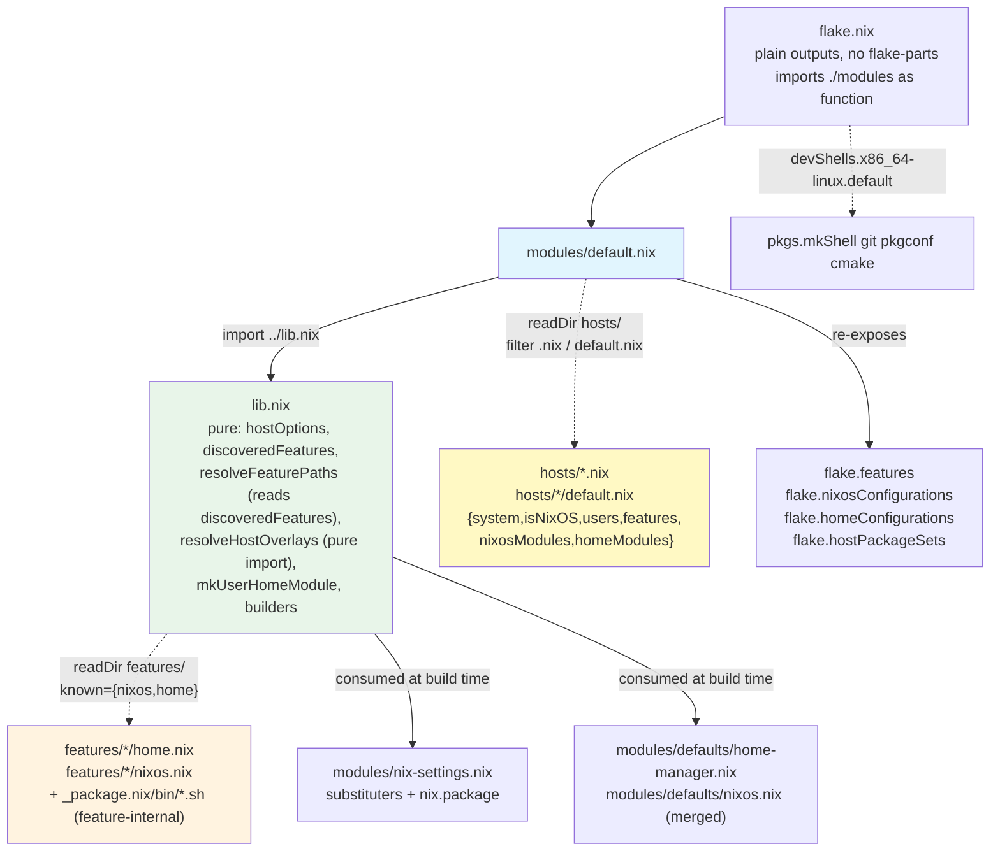
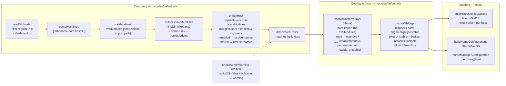
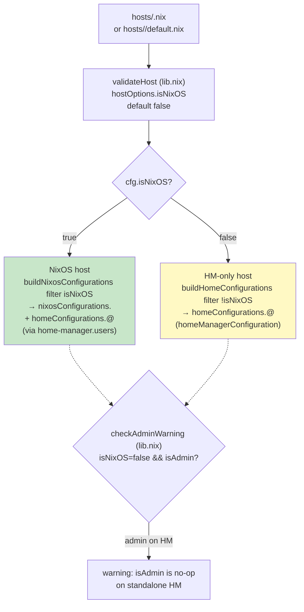
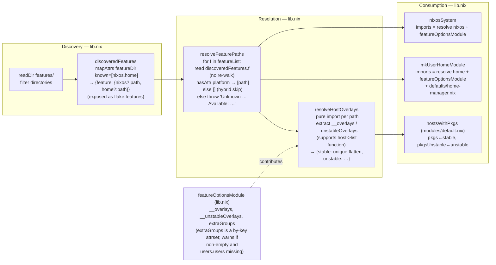
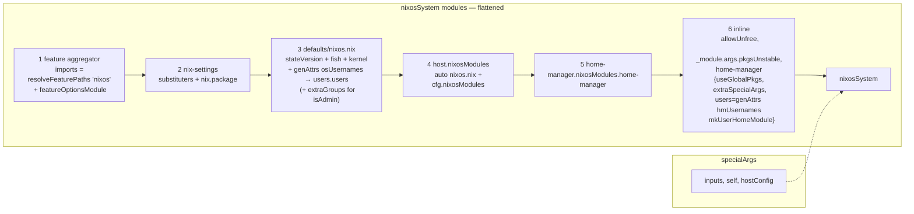
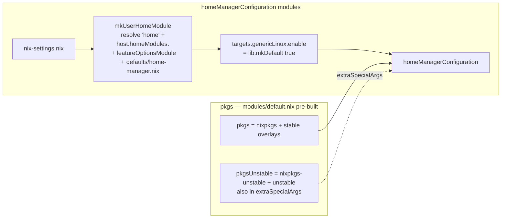
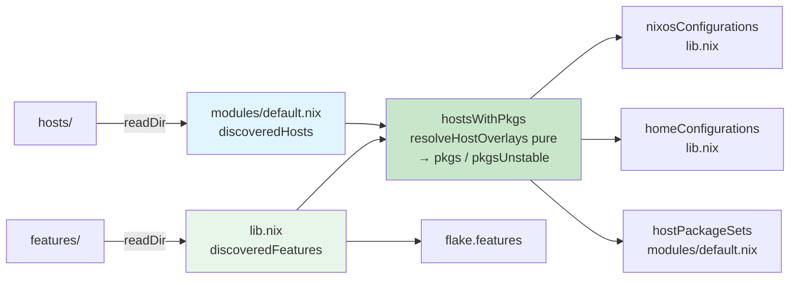

# DESIGN — Architecture & Dependencies

## File Layout

```
flakeroot/
├── flake.nix                       # plain outputs (no flake-parts), calls ./modules
├── lib.nix                         # pure lib: hostOptions, feature discovery, overlays, builders
├── hosts/                          # per-host declarations (auto-discovered)
│   ├── methyl-bazzite.nix          # HM-only flat host
│   ├── methyl/                     # NixOS host (bare metal)
│   │   ├── default.nix             #   {system,isNixOS,users,features}
│   │   ├── base.nix                #   shared NixOS config (no hw import)
│   │   ├── nixos.nix               #   host wrapper: hw-config + base
│   │   ├── home-josh.nix           #   per-user HM module
│   │   └── hardware-configuration.nix
│   └── methyl-nixos/               # NixOS host (QEMU VM — reuses methyl/)
│       ├── default.nix
│       ├── nixos.nix
│       ├── home-josh.nix           #   re-imports ../methyl/home-josh.nix
│       └── hardware-configuration.nix
├── features/                       # 36 composable units, auto-discovered
│   ├── hm-only    (11)             #   home.nix only
│   ├── nixos-only (17)             #   nixos.nix only
│   ├── hybrid      (8)             #   home.nix + nixos.nix: hm-syncthing, nixos-dmemcg, nixos-dms, nixos-flatpak, nixos-kde, nixos-lsfg, nixos-niri, nixos-oom
│   └── extras                      #   _package.nix / _*.nix / bin/ / *.sh imported by the feature itself
├── modules/
│   ├── default.nix                 # host discovery + pkgs wiring → nixosConfigurations/homeConfigurations
│   ├── bootstrap.nix               # swapfile+zswap for /etc/nixos/swap-prepare.nix (bootstrap.sh)
│   ├── nix-settings.nix            # substituters, trusted keys, nix.package
│   ├── defaults/
│   │   ├── home-manager.nix        # stateVersion, manual off, username/homeDirectory
│   │   └── nixos.nix               # stateVersion, fish, kernel + genAttrs osUsernames → users.users (+ extraGroups)
│   └── packages/
│       └── pyz-wrapper.nix         # generic .pyz fetcher (gamemode, etc.)
├── bootstrap.sh
├── flake.nix / flake.lock
├── lib.nix
└── DESIGN.md / README.md / REPORT.md / RESEARCH.md
```

Feature file convention: `home.nix` → HM platform, `nixos.nix` → NixOS platform. Extras (`_package.nix`, `_*.nix`, `bin/`, `*.sh`) are imported by the feature's own entry point, not discovered.

---

## Module Dependency Graph

Static `imports` vs. runtime `readDir`/`import`.


```mermaid
graph TB
    flake["flake.nix\nplain outputs, no flake-parts\nimports ./modules as function"] --> modDefault["modules/default.nix"]

    modDefault -- "import ../lib.nix" --> libNix["lib.nix\npure: hostOptions, discoveredFeatures,\nresolveFeaturePaths (reads discoveredFeatures),\nresolveHostOverlays (pure import),\nmkUserHomeModule, builders"]
    modDefault -. "readDir hosts/\nfilter .nix / default.nix" .-> hosts["hosts/*.nix\nhosts/*/default.nix\n{system,isNixOS,users,features,\n nixosModules,homeModules}"]
    libNix -. "readDir features/\nknown={nixos,home}" .-> features["features/*/home.nix\nfeatures/*/nixos.nix\n+ _package.nix/bin/*.sh (feature-internal)"]

    libNix -- "consumed at build time" --> nixSettings["modules/nix-settings.nix\nsubstituters + nix.package"]
    libNix -- "consumed at build time" --> defaults["modules/defaults/home-manager.nix\nmodules/defaults/nixos.nix (merged)"]
    modDefault -- "re-exposes" --> flakeOut["flake.features\nflake.nixosConfigurations\nflake.homeConfigurations\nflake.hostPackageSets"]
    flake -. "devShells.x86_64-linux.default" .-> devShell["pkgs.mkShell git pkgconf cmake"]

    style libNix fill:#e8f5e9
    style modDefault fill:#e1f5fe
    style hosts fill:#fff9c4
    style features fill:#fff3e0
```

`lib.nix` has no `options`/`config` at top level — pure functions. `modules/default.nix` is the sole impure wiring layer (`readDir`, `import`, `evalModules` for host validation only). `nix-settings.nix` and `defaults/*` are not statically imported by `modules/default.nix`; they are injected by the `buildNixosConfigurations`/`buildHomeConfigurations` builders in `lib.nix`.

---

## Build Pipeline

Evaluation order in `modules/default.nix` → `lib.nix`.


```mermaid
flowchart LR
    subgraph Disc ["Discovery — modules/default.nix"]
        scan["readDir hosts/\nfilter regular .nix\nor dir/default.nix"] --> parse["parseHostEntry\n{isDir,name,path,hostDir}"]
        parse --> validate["validateHost\nevalModules [hostOptions,\n import path]"]
        validate --> auto["autoDiscoverModules\nif isDir: nixos.nix?\n+ home-*.nix → homeModules"]
        auto --> enrich["enrichHost\nimpliedUsers from homeModules\nmergedUsers = implied // cfg.users\nenabled → osUsernames\nfiltered → hmUsernames"]
        enrich --> discovered["discoveredHosts\nmapAttrs buildHost"]
    end
    subgraph Pkgs ["Overlay & pkgs — modules/default.nix"]
        overlays["resolveHostOverlays (lib.nix)\n pure import (no evalModules)\n read __overlays / __unstableOverlays\n per feature path\n → {stable, unstable}"]
        mkPkgs["hostsWithPkgs\nmapAttrs host:\n pkgs= nixpkgs+stable\n pkgsUnstable= nixpkgs-unstable+unstable\n allowUnfree=true"]
        overlays --> mkPkgs
    end
    subgraph Out ["Builders — lib.nix"]
        nixos["buildNixosConfigurations\nfilter isNixOS\n→ nixosSystem per host"]
        hm["buildHomeConfigurations\nfilter !isNixOS\n→ homeManagerConfiguration\n per user@host"]
    end
    discovered --> overlays
    mkPkgs --> nixos & hm

    checkWarn["checkAdminWarning (lib.nix)\nisNixOS=false + isAdmin → warning"] -.-> discovered
```

`hostsWithPkgs` computed once in `modules/default.nix` and shared by both builders — single pure overlay extraction per host.

---

## Host Type Resolution


```mermaid
flowchart TD
    f["hosts/<name>.nix\nor hosts/<name>/default.nix"] --> v["validateHost (lib.nix)\n hostOptions.isNixOS default false"]
    v --> q{"cfg.isNixOS?"}
    q -->|true| N["NixOS host\nbuildNixosConfigurations filter isNixOS\n→ nixosConfigurations.<name>\n+ homeConfigurations.<user>@<name>\n(via home-manager.users)"]
    q -->|false| H["HM-only host\nbuildHomeConfigurations filter !isNixOS\n→ homeConfigurations.<user>@<name>\n(homeManagerConfiguration)"]

    N -.-> warnCheck{"checkAdminWarning (lib.nix)\nisNixOS=false && isAdmin?"}
    H -.-> warnCheck
    warnCheck -->|admin on HM| warn["warning: isAdmin is no-op\non standalone HM"]

    style N fill:#c8e6c9
    style H fill:#fff9c4
```

`isQemuVM` and `bootstrap` (declared in `hostOptions`, `lib.nix`) are orthogonal — they don't affect host classification, only feature/overlay gating downstream.

---

## Feature System


```mermaid
flowchart LR
    subgraph Discover ["Discovery — lib.nix"]
        scan["readDir features/\nfilter directories"] --> map["discoveredFeatures\nmapAttrs featureDir\n known=[nixos,home]\n→ {feature: {nixos?:path, home?:path}}\n(exposed as flake.features)"]
    end
    subgraph Resolve ["Resolution — lib.nix"]
        resolve["resolveFeaturePaths\nfor f in featureList:\n read discoveredFeatures.f (no re-walk)\n hasAttr platform → [path]\n else [] (hybrid skip)\n else throw 'Unknown … Available: …'"]
        collect["resolveHostOverlays\n pure import per path\n extract __overlays / __unstableOverlays\n (supports host->list function)\n → {stable: unique flatten, unstable: …}"]
        resolve --> collect
    end
    subgraph Consume ["Consumption — lib.nix"]
        nixosUse["nixosSystem\nimports = resolve nixos + featureOptionsModule"]
        hmUse["mkUserHomeModule\nimports = resolve home + featureOptionsModule\n+ defaults/home-manager.nix"]
        pkgsUse["hostsWithPkgs (modules/default.nix)\npkgs←stable, pkgsUnstable←unstable"]
    end
    map --> resolve
    collect --> pkgsUse
    resolve --> nixosUse & hmUse

    featOpt["featureOptionsModule (lib.nix)\n__overlays, __unstableOverlays, extraGroups\n(extraGroups is a by-key attrset; warns if\n non-empty and users.users missing)"] -. contributes .-> collect
```

A single walker owns discovery: `discoveredFeatures` is the one `readDir`, and `resolveFeaturePaths` resolves each listed feature against it (no second `pathExists` walk). Unknown feature throws with a sorted `Available:` list; a listed feature with no module for the requested platform resolves to `[]` (hybrid skip). Extras like `_package.nix`/`bin/*.pyz` are not discovered — the feature's own `home.nix`/`nixos.nix` imports them. Overlays declared as `__overlays = [inputs.xxx.overlay]` (or `host: [...]` for conditional) — extracted via plain `import` without throwaway `evalModules`.

**Listing a feature means it is enabled.** Every top-level `features.<name>.enable` defaults to `true` (`mkEnableOption … // {default = true;}`), so a host only lists the features it wants on; `enable = false` is the opt-out, and any per-feature attrs are knobs (e.g. `oomd.notify`, `dms.niriCompat`, `niri.niri-watcher.enable`). Sub-knobs that are opt-in (e.g. `niri.kanshi.enable`) stay default-false.

---

## Configuration Composition

### NixOS Host — `buildNixosConfigurations` (`lib.nix`)


```mermaid
flowchart LR
    subgraph Mods ["nixosSystem modules — flattened"]
        feat["1 feature aggregator\n imports = resolveFeaturePaths 'nixos'\n + featureOptionsModule"]
        nixSet["2 nix-settings\nsubstituters + nix.package"]
        defNixos["3 defaults/nixos.nix\nstateVersion + fish + kernel\n+ genAttrs osUsernames → users.users\n  (+ extraGroups for isAdmin)"]
        hostMods["4 host.nixosModules\n auto nixos.nix + cfg.nixosModules"]
        hmMod["5 home-manager.nixosModules.home-manager"]
        inline["6 inline\n allowUnfree,\n _module.args.pkgsUnstable,\n home-manager {useGlobalPkgs,\n  extraSpecialArgs, users=genAttrs hmUsernames\n   mkUserHomeModule}"]
        feat --> nixSet --> defNixos --> hostMods --> hmMod --> inline --> merged["nixosSystem"]
    end
    subgraph Args ["specialArgs"]
        sa["inputs, self, hostConfig"]
    end
    sa -.-> merged
```

`mkUserHomeModule` chain per user (`lib.nix`): `resolve home` + `host.homeModules.<user>` + `featureOptionsModule` + `defaults/home-manager.nix` + `_module.args.user`.

### HM-Only Host — `buildHomeConfigurations` (`lib.nix`)


```mermaid
flowchart LR
    subgraph Pkgs ["pkgs — modules/default.nix pre-built"]
        stable["pkgs = nixpkgs + stable overlays"]
        unstable["pkgsUnstable = nixpkgs-unstable + unstable\nalso in extraSpecialArgs"]
    end
    subgraph Mods2 ["homeManagerConfiguration modules"]
        nixSet2["nix-settings.nix"]
        userMod["mkUserHomeModule\n resolve 'home' + host.homeModules.<user>\n + featureOptionsModule\n + defaults/home-manager.nix"]
        generic["targets.genericLinux.enable\n = lib.mkDefault true"]
        nixSet2 --> userMod --> generic --> merged2["homeManagerConfiguration"]
    end
    stable --> merged2
    unstable -. extraSpecialArgs .-> merged2
```

---

## Data Flow Summary


```mermaid
graph LR
    hosts["hosts/"] -- readDir --> disc["modules/default.nix\ndiscoveredHosts"]
    features["features/"] -- readDir --> featMap["lib.nix\ndiscoveredFeatures"]
    disc --> hostsWithPkgs["hostsWithPkgs\nresolveHostOverlays pure\n→ pkgs / pkgsUnstable"]
    featMap --> hostsWithPkgs
    hostsWithPkgs --> nixosOut["nixosConfigurations\nlib.nix"]
    hostsWithPkgs --> hmOut["homeConfigurations\nlib.nix"]
    hostsWithPkgs --> pkgSets["hostPackageSets\nmodules/default.nix"]
    featMap --> flakeFeat["flake.features"]

    style disc fill:#e1f5fe
    style featMap fill:#e8f5e9
    style hostsWithPkgs fill:#c8e6c9
```

---

## Key Design Decisions

| Decision | Rationale |
|---|---|
| Single `lib.nix` (was `lib/`) | One pure file, no directory indirection; all shareable logic in one import |
| `isNixOS` bool | Explicit host classification; `false` default keeps HM-only hosts terse |
| `system` in host file | Single source of truth for `pkgs` system |
| Flat `hosts/<name>.nix` + directory hosts | Simple hosts stay one file; complex hosts auto-discover `nixos.nix`/`home-*.nix` |
| Feature dirs auto-discovered | No registry; add `features/foo/{home,nixos}.nix` and list `"foo"` in host — **listing = enabled** (`enable` defaults to `true`; `false` is the opt-out, per-feature attrs are knobs) |
| `__overlays`/`__unstableOverlays` pure (`featureOptionsModule`) | Features declare overlays as plain `__overlays = [...]` (or `host: [...]`); `resolveHostOverlays` extracts via `import` — no throwaway `evalModules {_module.check=false}` |
| `hostsWithPkgs` in `modules/default.nix` | Overlays extracted once, `pkgs`/`pkgsUnstable` reused by builders and exposed as `hostPackageSets` |
| `modules/defaults/*` collapsed (2 files) | `home-manager.nix` + merged `nixos.nix` (stateVersion/shell/kernel + `users.users` + `extraGroups` for `isAdmin`); not duplicated per host |
| `bootstrap` flag | Gates cache-dependent options during first deploy (`bootstrap.sh`) |
| `hmEnabled` per user | NixOS user exists without HM when `false` |
| `extraGroups` aggregation | Features declare groups as a **by-key attrset** (`extraGroups = { foo = ["grp"]; }`); the single consumer (`defaults/nixos.nix`) flattens `attrValues` for `isAdmin` users — no last-wins collision, no `lib.mkAppend` (absent in nixpkgs). Warns if non-empty and `users.users` unavailable |
| Plain `flake.nix` outputs (no `flake-parts`) | Single `x86_64-linux` system, `devShells.x86_64-linux.default` inline; removed framework tax (1 input, ~30 lock lines) |
